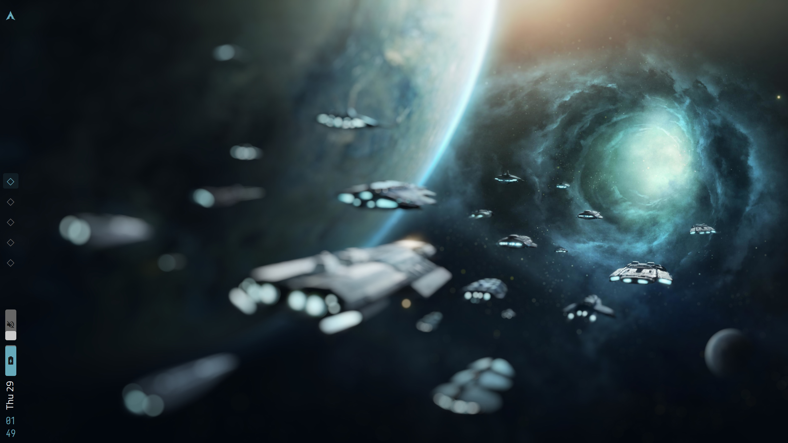

# warp

### Dependency list
- [ly](https://github.com/fairyglade/ly) - Login manager
- [kitty](https://sw.kovidgoyal.net/kitty/) - Terminal
- [cool-retro-term](https://github.com/Swordfish90/cool-retro-term) - Terminal
- [zim](https://github.com/eriner/zim) - Shell
- [bspwm](https://github.com/baskerville/bspwm) - Window manager
    - [sxhkd](https://github.com/baskerville/sxhkd) - Hotkey daemon for bspwm
    - [xdo](https://github.com/baskerville/xdo) - X window util
- [eww](https://github.com/elkowar/eww) - Status bar
    - [xtitle](https://github.com/baskerville/xtitle) - Window title util
    - pactl + Pipewire - Volume indicator
- [rofi](https://github.com/DaveDavenport/rofi) - Dmenu
- [feh](https://github.com/derf/feh) - Wallpaper setter
- [picom](https://github.com/yshui/picom) - Compositor
- [dunst](https://github.com/dunst-project/dunst) - Notification daemon
- [Noita](https://github.com/addy-dclxvi/gtk-theme-collections) - GTK theme

##### Extras
- vim with [pathogen](https://github.com/tpope/vim-pathogen) and [lightline](https://github.com/itchyny/lightline.vim) - Terminal editor
- [neofetch](https://github.com/dylanaraps/neofetch) - Sysinfo script
- xorg-xbacklight - Backlight control
- [xbanish](https://github.com/jcs/xbanish) - Cursor hiding script
- [redshift](https://github.com/jonls/redshift) - Screen temperature script

### Installation
Copy the following files and folders to their respective destinations
- `.config` folder > `~/.config`
- image > `/usr/share/wallpapers/`

Clone https://github.com/addy-dclxvi/gtk-theme-collections to ~/.themes and select Noita using LXAppearance

### Credits
- [stellaris_wormhole.jpg](./stellaris_wormhole.jpg) - Stellaris background with a blur applied
